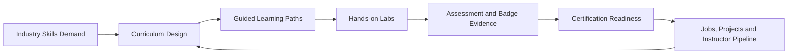

 

 
 

 

 

---

## 🚀 What we are building

**Skunkworks Academy** is a technical learning ecosystem for practical IT training, virtual labs, certification pathways, learner portals, instructor operations, partner delivery, and talent development.

We build learning infrastructure that connects:

<table>
<tr>
<td width="25%" align="center"><b>🎓 Learning</b> Self-paced, instructor-led, cohort and enterprise training</td>
<td width="25%" align="center"><b>🧪 Labs</b> Guided cloud, AI, cybersecurity, DevOps and infrastructure labs</td>
<td width="25%" align="center"><b>🏅 Credentials</b> Certification readiness, badges, assessments and exam pathways</td>
<td width="25%" align="center"><b>💼 Careers</b> Jobs, placements, mentors, instructors and professional networks</td>
</tr>
</table>

---

## 🧭 Ecosystem map

<table>
<tr>
<td width="50%">

### Core platforms

- 🌐 **Academy Home** — [skunkworksacademy.com](https://skunkworksacademy.com/)
- 🧑‍🎓 **Learner Portal** — [portal.skunkworksacademy.com](https://portal.skunkworksacademy.com/)
- 🧪 **Labs on Demand** — [labs.skunkworksacademy.com](https://labs.skunkworksacademy.com/)
- 💼 **Jobs Hub** — [jobs.skunkworksacademy.com](https://jobs.skunkworksacademy.com/)
- 📚 **Documentation** — [docs.skunkworksacademy.com](https://docs.skunkworksacademy.com/)

</td>
<td width="50%">

### Strategic capability areas

- 🤖 AI-assisted learning design and automation
- ☁️ Cloud, DevOps and platform engineering
- 🔐 Cybersecurity, IAM, governance and compliance
- 🧩 API, integration and application development
- 📡 Infrastructure, VoIP, networking and systems operations

</td>
</tr>
</table>

---

## 🧰 Technology and delivery stack

---

## 🏗️ Repository focus areas

<table>
<tr>
<td width="33%">

### 🎓 Learning engineering

- Course catalogues
- Curriculum templates
- Assessment frameworks
- Instructor guides
- Learner handbooks
- Badge and certification paths

</td>
<td width="33%">

### 🧪 Lab enablement

- Virtual lab landing pages
- Cloud sandbox workflows
- Practical exercises
- Remote lab guidance
- Validation scripts
- GitHub Classroom assets

</td>
<td width="33%">

### ⚙️ Platform operations

- Portal components
- Shared navigation
- CI/CD workflows
- GitHub profile assets
- Documentation automation
- Quality and accessibility checks

</td>
</tr>
</table>

---

## 📊 GitHub activity and visual signals

 
 

> Some dynamic cards depend on third-party GitHub README image services. If a card is temporarily unavailable, the underlying repositories and links remain accessible.

---

## 🌍 Operating model

---

## 🔐 Engineering principles

<table>
<tr>
<td width="25%" align="center"><b>Security first</b> Zero-trust thinking, least privilege and responsible data handling</td>
<td width="25%" align="center"><b>Automation by default</b> Repeatable workflows, validation scripts and CI/CD discipline</td>
<td width="25%" align="center"><b>Accessible learning</b> Structured content, clear navigation and learner-friendly experiences</td>
<td width="25%" align="center"><b>Evidence-based progress</b> Assessments, badges, portfolios and measurable outcomes</td>
</tr>
</table>

---

## 🤝 Collaboration

We collaborate with instructors, technologists, mentors, training providers, platform partners, employers and community builders who want to develop practical technology capability.

Good contribution areas include:

- improving course and lab documentation;
- strengthening portal and learner-experience components;
- adding validation, testing and accessibility checks;
- building certification-aligned learning pathways;
- improving career, job, mentor and instructor workflows.

---

## 📬 Connect

 
 

