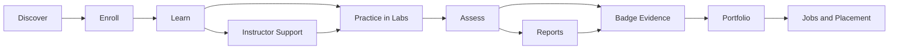

<div align="center">
  <a href="https://skunkworksacademy.com/">
    
  </a>

  <h1>Skunkworks Academy</h1>
  <h3>Dream. Design. Deliver.</h3>

  <p>
    <strong>A GitHub-powered technical learning ecosystem for self-paced courses, virtual labs, badges, learner portals, security enablement, IBM tracks, career pathways and instructor-led delivery.</strong>
  </p>

  <p>
    <a href="https://skunkworksacademy.com/"></a>
    <a href="https://github.com/skunkworks-academy/.github"></a>
    <a href="https://github.com/skunkworks-academy"></a>
  </p>

  <p>
    
    
    
    
    
    
    
    
    
  </p>
</div>

---

## What this repository does

This special `.github` repository is the public presentation layer for the **Skunkworks Academy** GitHub organisation. It stores the organisation profile README, shared visual assets, landing-page assets and repository-level documentation used to present the Academy as a coherent technical learning platform.

| Area | Purpose | Path / Link |
|---|---|---|
| Organisation profile | Public GitHub organisation front page | [`profile/README.md`](profile/README.md) |
| Academy landing assets | Static web-facing Academy entry page and shared navigation patterns | [`index.html`](index.html) |
| Brand icon assets | Shared favicon and GitHub profile visuals | [`images/`](images/) |
| Repository metadata | Central README, workflow and contribution orientation | [`README.md`](README.md) |

---

## Academy ecosystem

<table>
  <tr>
    <td width="33%">
      <h3>🎓 Learn</h3>
      <p>Self-paced pathways, instructor-led training, practical modules, learner guides and structured technical development programmes.</p>
    </td>
    <td width="33%">
      <h3>🧪 Practice</h3>
      <p>Virtual labs, sandbox environments, GitHub-based assignments, projects and applied technical exercises.</p>
    </td>
    <td width="33%">
      <h3>🏅 Prove</h3>
      <p>Badges, portfolios, assessment evidence, capstones, readiness records and employability-aligned outputs.</p>
    </td>
  </tr>
  <tr>
    <td width="33%">
      <h3>🛡️ Secure</h3>
      <p>Cybersecurity, secure coding, identity, cloud governance, compliance and defensive operations enablement.</p>
    </td>
    <td width="33%">
      <h3>🏢 Enable</h3>
      <p>Enterprise tracks across IBM, Microsoft, Cisco, CompTIA, cloud, automation, data, AI and infrastructure.</p>
    </td>
    <td width="33%">
      <h3>💼 Place</h3>
      <p>Career pathways, job readiness, talent pipelines, partner delivery capacity and instructor development.</p>
    </td>
  </tr>
</table>

---

## Primary destinations

| Destination | Description | Link |
|---|---|---|
| **Academy Home** | Central public Academy landing page | [skunkworksacademy.com](https://skunkworksacademy.com/) |
| **Self-paced Catalogue** | Flexible learner pathways and online courses | [Self-paced](https://skunkworksacademy.com/self-paced/) |
| **Learner Portal** | Student, instructor and operations portal | [Portal](https://portal.skunkworksacademy.com/) |
| **Labs** | On-demand virtual labs and sandboxes | [Labs](https://labs.skunkworksacademy.com/) |
| **Badge Hub** | Credential evidence and digital badge pathways | [Badging](https://badging.skunkworksacademy.com/) |
| **Jobs** | Career readiness, job discovery and placement pathways | [Jobs](https://jobs.skunkworksacademy.com/) |
| **Security** | Cybersecurity and compliance learning tracks | [Security](https://security.skunkworksacademy.com/) |
| **IBM Enablement** | IBM Power, LinuxONE, automation, cloud, security and data tracks | [IBM](https://ibm.skunkworksacademy.com/) |
| **Documentation** | Academy guidance, policies and operating documentation | [Docs](https://docs.skunkworksacademy.com/) |
| **Blog** | Academy articles, announcements and campaign content | [Blog](https://blog.skunkworksacademy.com/) |

---

## Technical domains

<p>
  
  
  
  
  
  
  
  
</p>

---

## Delivery model



| Stage | Output |
|---|---|
| **Discover** | Learner selects a pathway or Academy domain |
| **Enroll** | Portal, forms and onboarding workflow activated |
| **Learn** | Self-paced or instructor-led course delivery |
| **Practice** | Labs, projects, assignments and applied exercises |
| **Assess** | Knowledge checks, capstones and evidence review |
| **Badge** | Credential pathway, achievement evidence and portfolio artefacts |
| **Place** | Job readiness, employer matching and talent pipeline activation |

---

## Repository role inside the Academy stack

This repository is intentionally small, visible and brand-facing. It should remain focused on the organisation profile and global Academy presentation assets rather than becoming a course-content dump.

| Responsibility | Notes |
|---|---|
| **Profile README** | Controls what visitors see on the `skunkworks-academy` GitHub organisation page. |
| **Visual identity** | Stores the shared favicon and logo assets used by public pages and profile docs. |
| **Landing-page coordination** | Supports the public Academy landing page and navigation alignment. |
| **Contributor orientation** | Gives maintainers a fast map of the Academy ecosystem and where work belongs. |

---

## Recommended repository standards

- Use clear, descriptive repository names.
- Keep learning content, lab code and portal code in separate repositories.
- Add `README.md`, `LICENSE`, `.gitignore` and workflow status badges to every active repo.
- Use GitHub Issues or Projects for backlog visibility.
- Protect production branches where deployment is connected to public Academy domains.
- Keep public READMEs polished because they act as partner, learner and employer-facing collateral.

---

## Contributor quick start

```bash
# Clone the organisation profile repository
git clone https://github.com/skunkworks-academy/.github.git
cd .github

# Create a feature branch
git checkout -b feature/update-profile-readme

# Edit profile/README.md or README.md, then commit
git add README.md profile/README.md
git commit -m "Update Academy profile README"
git push -u origin feature/update-profile-readme
```

---

## Contact and links

| Channel | Link |
|---|---|
| Website | [skunkworksacademy.com](https://skunkworksacademy.com/) |
| GitHub | [github.com/skunkworks-academy](https://github.com/skunkworks-academy) |
| Training | [training@skunkworks.africa](mailto:training@skunkworks.africa) |
| Portal | [portal.skunkworksacademy.com](https://portal.skunkworksacademy.com/) |
| Labs | [labs.skunkworksacademy.com](https://labs.skunkworksacademy.com/) |

---

<div align="center">
  <strong>Skunkworks Academy</strong><br />
  Technical learning. Practical labs. Verified skills. Career pathways.
</div>
