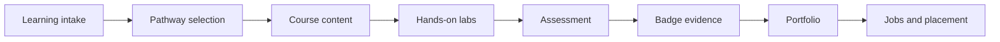

  

  <h1>Skunkworks Academy</h1>
  <h3>Dream. Design. Deliver.</h3>

  

    <strong>A practical technology academy connecting learning, labs, credentials and talent pipelines across AI, cloud, cybersecurity, DevOps, data, IBM, Microsoft, Cisco, CompTIA and enterprise infrastructure.</strong>
  

  

    
    
    
    
  

  

    
    
    
    
    
    
    
    
  

---

## Mission

**Skunkworks Academy** builds practical, job-aligned technical learning experiences. We connect course design, live delivery, self-paced learning, virtual labs, badge evidence and career readiness into one operating model.

Our focus is simple: learners should not only consume content. They should build, practise, prove and progress.

---

## Ecosystem map

<table>
  <tr>
    <td width="33%">
      <h3>🎓 Learning</h3>
      
Instructor-led training, self-paced pathways, learning catalogues, bootcamps and modular technical content.

      
<a href="https://skunkworksacademy.com/self-paced/"><strong>Explore self-paced →</strong></a>

    </td>
    <td width="33%">
      <h3>🧪 Labs</h3>
      
Practical sandboxes, cloud labs, GitHub assignments, exercises and assessment environments.

      
<a href="https://labs.skunkworksacademy.com/"><strong>Launch labs →</strong></a>

    </td>
    <td width="33%">
      <h3>🏅 Credentials</h3>
      
Badge pathways, practical evidence, portfolios and verifiable learner achievement records.

      
<a href="https://badging.skunkworksacademy.com/"><strong>View badge hub →</strong></a>

    </td>
  </tr>
  <tr>
    <td width="33%">
      <h3>🛡️ Security</h3>
      
Cybersecurity, governance, secure coding, identity, cloud security and SOC readiness.

      
<a href="https://security.skunkworksacademy.com/"><strong>Security tracks →</strong></a>

    </td>
    <td width="33%">
      <h3>🏢 Enterprise</h3>
      
IBM, Microsoft, Cisco, CompTIA, cloud, AI, automation, infrastructure and data enablement.

      
<a href="https://ibm.skunkworksacademy.com/"><strong>IBM enablement →</strong></a>

    </td>
    <td width="33%">
      <h3>💼 Talent</h3>
      
Career readiness, job discovery, placement pathways, instructor development and partner capacity.

      
<a href="https://jobs.skunkworksacademy.com/"><strong>Explore jobs →</strong></a>

    </td>
  </tr>
</table>

---

## Technical focus areas

  
  
  
  
  
  
  
  

---

## Platform destinations

| Destination | Purpose | Link |
|---|---|---|
| **Academy Home** | Public front door for Skunkworks Academy | [skunkworksacademy.com](https://skunkworksacademy.com/) |
| **Portal** | Learner, instructor and operations access | [portal.skunkworksacademy.com](https://portal.skunkworksacademy.com/) |
| **Labs** | On-demand virtual labs and technical sandboxes | [labs.skunkworksacademy.com](https://labs.skunkworksacademy.com/) |
| **Self-paced Catalogue** | Flexible learning paths and course entry points | [Self-paced](https://skunkworksacademy.com/self-paced/) |
| **Badge Hub** | Badge evidence and credential pathways | [badging.skunkworksacademy.com](https://badging.skunkworksacademy.com/) |
| **Jobs** | Career discovery and placement support | [jobs.skunkworksacademy.com](https://jobs.skunkworksacademy.com/) |
| **Security** | Cybersecurity learning and governance tracks | [security.skunkworksacademy.com](https://security.skunkworksacademy.com/) |
| **IBM Enablement** | Enterprise infrastructure, IBM Power, LinuxONE and related tracks | [ibm.skunkworksacademy.com](https://ibm.skunkworksacademy.com/) |
| **Documentation** | Academy operating guidance and learner documentation | [docs.skunkworksacademy.com](https://docs.skunkworksacademy.com/) |
| **Blog** | Updates, announcements and technical articles | [blog.skunkworksacademy.com](https://blog.skunkworksacademy.com/) |

---

## Learning-to-career flow

---

## Who we support

| Audience | How Skunkworks Academy helps |
|---|---|
| **Learners** | Clear pathways, practical labs, badges, projects and job readiness. |
| **Instructors** | Delivery assets, labs, course structures, assessment patterns and facilitation support. |
| **Employers** | Skills pipelines, practical evidence, talent placement and upskilling programmes. |
| **Partners** | Delivery capacity, technical enablement, learning operations and scalable content development. |
| **Contributors** | GitHub-native workflows for course assets, platform content, labs and documentation. |

---

## GitHub operating principles

- Keep repositories focused: one major platform, course family or lab stack per repository.
- Use READMEs as product-facing documentation, not only developer notes.
- Prefer visible issues, clear milestones and lightweight project boards.
- Keep labs reproducible and documented.
- Treat learner outputs as evidence: code, labs, badges, reports and portfolio artefacts.
- Maintain secure-by-default examples and avoid committing secrets or learner private data.

---

## Contact

| Channel | Link |
|---|---|
| Website | [skunkworksacademy.com](https://skunkworksacademy.com/) |
| GitHub | [github.com/skunkworks-academy](https://github.com/skunkworks-academy) |
| Training | [training@skunkworks.africa](mailto:training@skunkworks.africa) |
| Portal | [portal.skunkworksacademy.com](https://portal.skunkworksacademy.com/) |
| Labs | [labs.skunkworksacademy.com](https://labs.skunkworksacademy.com/) |

---

  <strong>Technical learning. Practical labs. Verified skills. Career pathways.</strong>

